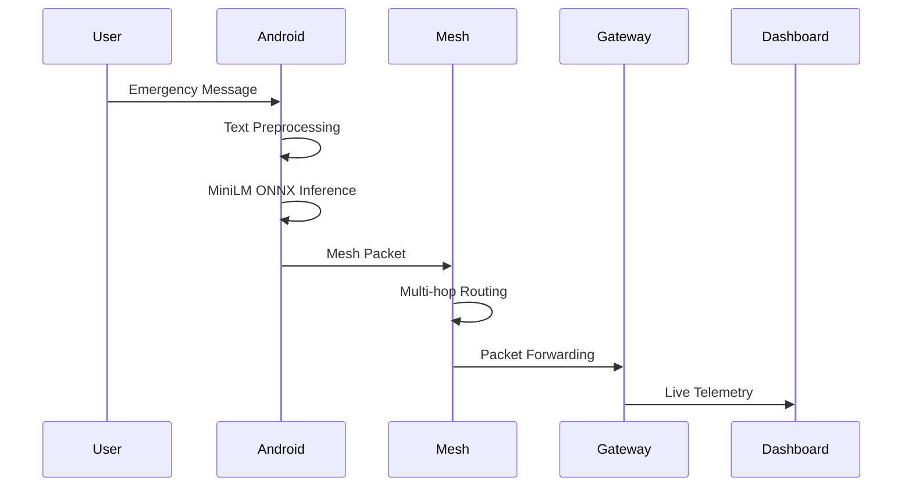
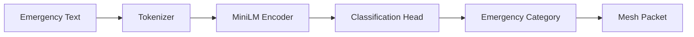
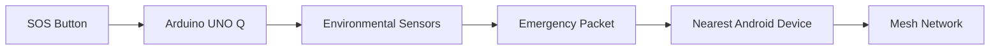
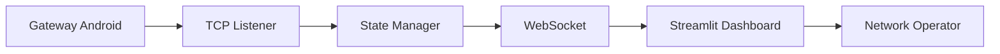
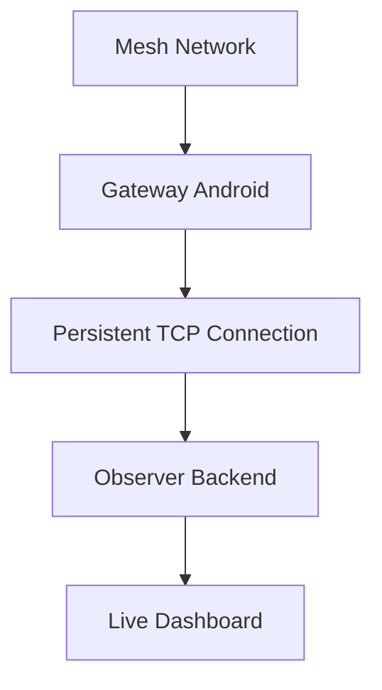

<p align="center">


</p>

<h1 align="center">
MeshMind
</h1>

<h3 align="center">
AI Powered Decentralized Emergency Mesh Communication Network
</h3>

<p align="center">

Offline Communication • Edge AI • Qualcomm Snapdragon • BLE Mesh • Wi-Fi Direct

</p>

<p align="center">


</p>

---

# 📖 Overview

MeshMind is an **AI-powered decentralized emergency communication platform**
designed for situations where conventional communication infrastructure
is unavailable, congested, or destroyed.

Instead of depending on cellular towers or the Internet,
MeshMind allows Android devices to automatically discover nearby devices,
form an intelligent mesh network,
route emergency messages across multiple hops,
and synchronize with an Observer Dashboard whenever connectivity becomes available.

The system combines:

- Edge Artificial Intelligence
- Bluetooth Low Energy Discovery
- Wi-Fi Direct Communication
- Multi-hop Mesh Routing
- Qualcomm Snapdragon Edge Deployment
- Arduino Emergency Nodes
- AI-powered Observer Dashboard

to provide resilient communication during disasters, crowded events,
search-and-rescue missions, and remote environments.

---

# 🎯 Problem Statement

Large public gatherings and disaster situations frequently experience communication failures because they rely on centralized cellular infrastructure.

Examples include:

- Network congestion during Kumbh Mela
- Stadium events
- Music concerts
- Emergency evacuations
- Floods
- Earthquakes
- Wildfires
- Search & Rescue operations

When infrastructure fails:

❌ Calls cannot connect

❌ Messages are delayed

❌ Emergency responders lose coordination

❌ Victims cannot request help

MeshMind eliminates this dependency by enabling communication directly between nearby devices.

---

# 🚀 Solution

MeshMind creates a fully decentralized communication ecosystem.

Instead of relying on mobile towers,

Android devices automatically:

```text
Discover Nearby Devices

        ↓

Create Mesh Network

        ↓

Run Edge AI

        ↓

Classify Emergency

        ↓

Route Packets

        ↓

Reach Destination

        ↓

Synchronize Dashboard
```

Every Android phone becomes a communication node.

If Internet later becomes available,

one Android device automatically becomes a **Gateway Node**
and synchronizes the complete mesh state with the Observer Dashboard.

---

# ✨ Key Features

✅ Completely Offline Communication

✅ Bluetooth Low Energy Discovery

✅ Wi-Fi Direct Mesh Formation

✅ Multi-hop DSDV Routing

✅ Edge AI Emergency Classification

✅ Qualcomm Snapdragon Deployment

✅ ONNX Runtime Inference

✅ Arduino UNO Q SOS Nodes

✅ Observer Dashboard

✅ Automatic Gateway Election

✅ Live Mesh Visualization

✅ Packet Flow Monitoring

✅ Dynamic Network Analytics

---

# 🌍 Real World Use Cases

## 1️⃣ Mass Gatherings

Examples

- Kumbh Mela
- Stadium Events
- Concerts
- Marathons
- Religious Gatherings

```text
Network Congestion

↓

BLE Discovery

↓

Wi-Fi Direct Mesh

↓

AI Classification

↓

Multi-hop Routing

↓

Security Personnel
```

Benefits

- No dependency on mobile towers

- Faster emergency reporting

- Crowd coordination

- Offline communication

---

## 2️⃣ Search and Rescue

Examples

- Forest Search

- Mountain Rescue

- Military Patrol

- Wildlife Rescue

```text
Rescue Team

↓

BLE Mesh

↓

Packet Routing

↓

Gateway

↓

Command Center
```

Benefits

- Communication without towers

- Long-distance coordination

- Offline GPS sharing

- Team synchronization

---

## 3️⃣ Disaster Management

Examples

- Earthquakes

- Floods

- Cyclones

- Building Collapse

- Wildfires

```text
Arduino SOS

↓

Android Mesh

↓

Emergency Routing

↓

Gateway

↓

Observer Dashboard
```

Benefits

- Infrastructure independent

- Emergency coordination

- Sensor monitoring

- Faster response

---

# 🏆 Why MeshMind?

| Traditional Communication | MeshMind |
|--------------------------|----------|
| Requires Internet | ❌ |
| Requires Cellular Tower | ❌ |
| Works Offline | ✅ |
| Edge AI | ✅ |
| Mesh Networking | ✅ |
| Multi-hop Routing | ✅ |
| Arduino Integration | ✅ |
| Observer Dashboard | ✅ |
| Qualcomm Ready | ✅ |

---

# 📌 Highlights

- Fully decentralized communication

- AI inference executed directly on Android devices

- Qualcomm Snapdragon optimized deployment

- Real-time Observer Dashboard

- Arduino hardware integration

- Dynamic gateway synchronization

- Completely infrastructure independent

---

> **Built for Qualcomm Snapdragon Multiverse Hackathon 2026**
>
> *Building resilient emergency communication through Edge AI and decentralized mesh networking.*
# 🏗️ System Architecture

MeshMind follows a decentralized edge-computing architecture where every Android
device acts as both a communication endpoint and a routing node. Artificial
Intelligence executes entirely on the originating Android device before packets
are injected into the mesh. Intermediate devices simply relay packets using the
routing protocol, while the AI PC serves only as an observer whenever a gateway
becomes available.


---

# 📡 Communication Workflow

The communication pipeline begins when a user creates an emergency message.
Instead of sending it through a mobile tower, the message is processed locally,
classified using Edge AI, converted into a MeshMind packet, and routed through
neighboring Android devices until it reaches its destination.



---

# 🧠 Edge AI Pipeline

Every emergency message is processed completely offline on the originating
Android device.

No cloud inference is required.

No Internet connection is required.

Only the prediction result is inserted into the transmitted packet.



### AI Model

| Component | Details |
|-----------|----------|
| Backbone | sentence-transformers/all-MiniLM-L6-v2 |
| Deployment | ONNX Runtime |
| Execution | Snapdragon CPU / NPU |
| Framework | PyTorch → ONNX |
| Inference | Fully Offline |
| Classes | 8 Emergency Categories |

---

# 📶 Networking Stack

MeshMind uses multiple communication technologies together to achieve
infrastructure-independent communication.


### Communication Responsibilities

| Technology | Purpose |
|------------|---------|
| BLE | Discover nearby devices |
| Wi-Fi Direct | Create high-speed peer-to-peer links |
| TCP | Reliable packet transport |
| DSDV | Multi-hop routing |
| Gateway Service | Synchronize Observer Dashboard |

---

# 📦 MeshMind Packet Flow

Every transmitted message follows the same lifecycle.


---

# 🤖 Arduino Integration

MeshMind supports dedicated emergency hardware using Arduino UNO Q.

The Arduino can operate even when no smartphones are immediately available.

It continuously monitors sensors and allows users to manually trigger an SOS.



### Supported Sensors

- Smoke Sensor

- Gas Sensor

- Temperature Sensor

- Humidity Sensor

- Motion Detection

- Manual SOS Button

---

# 🖥️ Observer Dashboard Architecture

The AI PC never participates in mesh communication.

Instead, one Android device automatically becomes the Gateway Node whenever it
obtains connectivity to the Observer PC.



---

# 📊 Dashboard Components

The Observer Dashboard continuously visualizes the real mesh state.

It does not generate simulated data.

Everything displayed originates from genuine MeshMind packets.

### Dashboard Panels

📍 Live Mesh Topology

📦 Packet Flow Animation

🚨 Emergency Feed

🤖 AI Predictions

📡 Network Statistics

🔋 Battery Monitoring

📶 Signal Strength

🛰 Gateway Status

📝 Packet History

📈 Network Analytics

---

# 🔄 Gateway Synchronization

When Internet or a local connection becomes available,
one Android node automatically becomes the Gateway.

The gateway continues participating in the mesh while simultaneously forwarding
copies of packets to the Observer Dashboard.



If the Gateway disconnects,

another Android device automatically assumes the role without interrupting
mesh communication.

---

# ⚙️ Deployment Pipeline

The trained AI model follows a complete deployment pipeline before being
integrated into the Android application.

```mermaid
flowchart LR

PyTorch

-->

Training

-->

Validation

-->

ONNX Export

-->

ONNX Runtime Validation

-->

Qualcomm AI Hub

-->

Android Deployment
```

---

# 📂 Core Components

| Module | Responsibility |
|---------|----------------|
| Android App | User Interface + Communication |
| MiniLM ONNX | Edge AI Classification |
| BLE Manager | Device Discovery |
| Wi-Fi Direct Manager | Peer Communication |
| DSDV Router | Multi-hop Packet Routing |
| Gateway Service | Dashboard Synchronization |
| Arduino UNO Q | SOS Hardware |
| Observer Backend | Packet Processing |
| Streamlit Dashboard | Network Visualization |

---

# 🔐 Design Principles

- Fully Decentralized

- Offline First

- Infrastructure Independent

- Edge AI Execution

- Multi-hop Communication

- Automatic Gateway Election

- Real-time Monitoring

- Qualcomm Optimized

- Modular Architecture

- Production Ready
# 📁 Project Structure

The project is organized into modular components to separate mobile communication,
AI inference, embedded hardware, and network monitoring.

```text
MeshMind/
│
├── android-app/                 # Android mesh communication application
│   ├── app/
│   ├── ble/
│   ├── wifi_direct/
│   ├── routing/
│   ├── ai/
│   ├── gateway/
│   └── ui/
│
├── observer-dashboard/          # AI PC Dashboard
│   ├── backend/
│   ├── frontend/
│   ├── shared/
│   └── scripts/
│
├── ai-model/
│   ├── training/
│   ├── notebooks/
│   ├── exported_models/
│   └── artifacts/
│
├── arduino/
│   ├── firmware/
│   └── sensors/
│
├── docs/
│
├── assets/
│
├── LICENSE
│
└── README.md
```

---

# 💻 System Requirements

## Android

- Android 11 or above
- Bluetooth Low Energy
- Wi-Fi Direct Support
- Snapdragon Processor Recommended

---

## Observer Dashboard

- Windows / Linux / macOS

- Python 3.10+

- 8 GB RAM (Minimum)

- 16 GB RAM (Recommended)

---

## Arduino

- Arduino UNO R4 WiFi / Arduino UNO Q

Supported Sensors

- Smoke

- Temperature

- Gas

- Motion

- Manual SOS Button

---

# ⚙️ Software Stack

| Layer | Technology |
|---------|------------|
| Mobile | Kotlin |
| AI | PyTorch |
| Inference | ONNX Runtime |
| Edge Deployment | Qualcomm AI Hub |
| Dashboard | Streamlit |
| Backend | FastAPI |
| Visualization | D3.js |
| Embedded | Arduino C++ |

---

# 🚀 Installation

Clone the repository

```bash
git clone https://github.com/your-repository/MeshMind.git

cd MeshMind
```

---

## Install Dashboard Dependencies

```bash
cd observer-dashboard

python -m venv venv
```

Windows

```bash
venv\Scripts\activate
```

Linux

```bash
source venv/bin/activate
```

Install packages

```bash
pip install -r requirements.txt
```

---

# 🤖 AI Model Setup

The trained MiniLM ONNX model is already included.

Artifacts

```text
artifacts/

meshmind_classifier.onnx

label_map.json

tokenizer/

training_config.json

preprocessing_config.json

deployment_config.json
```

No retraining is required.

---

# ▶ Running the Observer Backend

Navigate to

```text
observer-dashboard/
```

Run

```bash
python -m backend.server
```

Expected output

```text
TCP Telemetry

0.0.0.0:5000

WebSocket

0.0.0.0:8765

HTTP API

0.0.0.0:8000
```

---

# 📊 Running the Dashboard

Open another terminal

```bash
streamlit run frontend/app.py
```

Default URL

```text
http://localhost:8501
```

---

# 📱 Running the Android Application

Open

```text
android-app/
```

using

Android Studio

Sync Gradle

Connect Android device

Build APK

Install application

Enable

- Bluetooth

- Wi-Fi

- Location Permission

---

# 🤝 Mesh Formation

Once multiple Android devices launch MeshMind

```text
BLE Discovery

↓

Nearby Device Detection

↓

Automatic Peer Discovery

↓

Wi-Fi Direct Connection

↓

Routing Table Creation

↓

Mesh Formation
```

No Internet is required.

---

# 🧠 AI Inference Pipeline

Every emergency message follows

```text
Emergency Message

↓

Tokenizer

↓

MiniLM Encoder

↓

Classification Head

↓

Emergency Category

↓

Confidence Score

↓

Mesh Packet
```

Inference executes entirely on the Android device.

---

# 📡 Gateway Operation

Whenever one Android device obtains connectivity to the Observer PC

```text
Mesh Network

↓

Gateway Election

↓

Persistent TCP Connection

↓

Observer Backend

↓

Dashboard Update
```

Gateway election is automatic.

No manual configuration is required.

---

# 📦 Qualcomm Deployment Package

The exported deployment package contains

```text
MeshMind_Deployment/

meshmind_classifier.onnx

label_map.json

deployment_config.json

deployment_report.json

tokenizer/

preprocessing_config.json

training_config.json
```

Deployment Target

- Qualcomm Snapdragon

Inference Engine

- ONNX Runtime

Execution

- Offline

---

# 🔄 Communication Protocol

Communication inside the mesh uses

```text
BLE

↓

Wi-Fi Direct

↓

TCP

↓

MeshMind Packet

↓

DSDV Routing
```

Dashboard communication

```text
Gateway

↓

TCP Socket

↓

Observer Backend

↓

WebSocket

↓

Dashboard
```

---

# 🌐 Network Ports

| Port | Service |
|-------|----------|
| 5000 | TCP Telemetry |
| 8765 | WebSocket |
| 8000 | HTTP API |
| 8501 | Streamlit |

---

# 🔧 Configuration

Environment variables

```text
MESHMIND_TCP_PORT

MESHMIND_WS_PORT

MESHMIND_HTTP_PORT

MESHMIND_HEARTBEAT_TIMEOUT

MESHMIND_CRITICAL_CONFIDENCE
```

Modify these variables according to deployment requirements.

---

# 📈 Deployment Workflow

```text
Train Model

↓

Export ONNX

↓

Validate ONNX

↓

Package Artifacts

↓

Deploy Android

↓

Deploy Dashboard

↓

Run Mesh

↓

Gateway Sync

↓

Live Monitoring
```

---

# 🧪 Development Workflow

Developer cycle

```text
Modify Android Code

↓

Build APK

↓

Install Device

↓

Create Mesh

↓

Observe Dashboard

↓

Analyze Logs

↓

Repeat
```

---

# 🛠 Troubleshooting

## Dashboard cannot connect

- Verify backend is running

- Check firewall

- Verify WebSocket port

---

## Android devices cannot discover each other

- Enable Bluetooth

- Enable Location

- Enable Wi-Fi

- Restart discovery

---

## Gateway not detected

- Verify laptop and gateway are reachable

- Verify TCP port 5000

- Check Gateway Service logs

---

## AI model not loading

Verify

```text
meshmind_classifier.onnx

tokenizer/

label_map.json
```

exist inside

```text
artifacts/
```

---

# ✅ Verification Checklist

Before deployment

- Android APK installed

- BLE enabled

- Wi-Fi Direct enabled

- AI model loaded

- Backend running

- Dashboard connected

- Gateway connected

- Arduino operational

- Mesh formed successfully

- Live topology visible
# 📊 Performance & Benchmark Results

MeshMind has been optimized for lightweight, real-time inference on Qualcomm
Snapdragon-powered edge devices. The deployed model is validated using ONNX
Runtime and is designed for low latency while maintaining high classification
accuracy.

## Model Summary

| Metric | Value |
|---------|-------|
| Backbone | sentence-transformers/all-MiniLM-L6-v2 |
| Model Format | ONNX |
| ONNX Opset | 18 |
| Model Size | ~0.75 MB |
| Number of Parameters | 782,193 |
| Initializers | 128 |
| ONNX Nodes | 306 |
| Number of Classes | 8 |
| Execution | Fully Offline |
| Deployment | Qualcomm Snapdragon |

---

## Validation Results

| Metric | Result |
|---------|---------|
| PyTorch ↔ ONNX Agreement | **100%** |
| ONNX Validation | ✅ Passed |
| Average CPU Latency | ~30 ms/sample |
| Deployment Status | READY |

---

## AI Classification Categories

MeshMind classifies emergency messages into the following categories:

- 🚨 Medical Emergency
- 🔥 Fire Incident
- 🌊 Flood Situation
- 🏚 Infrastructure Damage
- 🚑 Rescue Request
- ⚠ Public Safety Alert
- 📢 Information Broadcast
- 📍 General Emergency

---

# ⚡ Qualcomm Snapdragon Optimization

MeshMind has been specifically designed for Qualcomm's edge computing ecosystem.

### Deployment Features

- ✅ ONNX Runtime Compatible
- ✅ Qualcomm AI Hub Ready
- ✅ Edge AI Execution
- ✅ Offline Inference
- ✅ Low Memory Footprint
- ✅ Lightweight Transformer Architecture
- ✅ Snapdragon CPU Compatible
- ✅ NPU Ready Architecture
- ✅ Real-time Inference

---

# 🔒 Security & Privacy

MeshMind follows an **Edge-First Privacy Model**.

Unlike traditional communication systems, user messages never require cloud
processing.

### Security Principles

- Edge AI Inference
- No Cloud Dependency
- Local Packet Routing
- Infrastructure Independent
- Offline Communication
- Distributed Architecture
- No Centralized Message Storage
- Automatic Gateway Synchronization

Only the originating Android device performs AI inference.
Intermediate devices forward encrypted packets without reprocessing user data.

---

# 🌟 Project Highlights

✅ Fully Decentralized Communication

✅ Offline Emergency Messaging

✅ Qualcomm Snapdragon Deployment

✅ MiniLM Edge AI

✅ BLE Device Discovery

✅ Wi-Fi Direct Mesh

✅ DSDV Multi-hop Routing

✅ Arduino UNO Q SOS Integration

✅ Observer Dashboard

✅ Automatic Gateway Election

✅ Infrastructure Independent

---

# 🚀 Future Roadmap

MeshMind is designed as a scalable emergency communication platform.

Future enhancements include:

### Communication

- LoRa Integration
- Satellite Communication
- Hybrid Mesh Routing
- Drone-based Relay Nodes
- Cross-platform Support

### Artificial Intelligence

- Federated Learning
- On-device Personalization
- Voice-based Emergency Detection
- Image-based Disaster Recognition
- Video Analytics

### Dashboard

- GIS Map Integration
- Digital Twin Visualization
- Predictive Network Analytics
- Emergency Resource Allocation
- AI-assisted Decision Support

### Embedded Systems

- Additional Sensor Modules
- Solar-powered Emergency Nodes
- Wearable Mesh Devices
- Smart City Integration

---

# 📚 Documentation

Complete documentation is available inside the repository.

```text
docs/

Architecture

Communication Protocol

Deployment Guide

Dashboard Documentation

Android Documentation

Arduino Documentation

AI Model Documentation
```

---

# 👨‍💻 Team

| Name | Role |
|------|------|
| Your Name | AI & Machine Learning |
| Team Member | Android Development |
| Team Member | Embedded Systems |
| Team Member | Backend & Dashboard |

---

# 🤝 Contributing

We welcome contributions from the open-source community.

To contribute:

```bash
Fork Repository

↓

Create Feature Branch

↓

Commit Changes

↓

Push Branch

↓

Open Pull Request
```

Please ensure all pull requests are properly documented and tested before submission.

---

# 📜 License

This project is released under the **MIT License**.

You are free to use, modify, distribute, and build upon this work under the terms of the license.

See the **LICENSE** file for additional details.

---

# 🙏 Acknowledgements

We would like to thank:

- Qualcomm Snapdragon Multiverse Hackathon
- Qualcomm AI Hub
- Hugging Face
- ONNX Runtime
- PyTorch
- Streamlit
- Arduino Community
- Android Open Source Project
- Open-source contributors

for providing the tools and ecosystem that made MeshMind possible.

---

# 📬 Contact

For questions, collaborations, or feedback:

📧 Email: your-email@example.com

💼 LinkedIn: https://linkedin.com/in/your-profile

💻 GitHub: https://github.com/Mrudaya321/MeshMind-AI

---

# ⭐ Support the Project

If you found MeshMind useful, consider supporting the project.

⭐ Star this repository

🍴 Fork the project

🛠 Contribute improvements

📢 Share the project

---

# 🏆 Qualcomm Snapdragon Multiverse Hackathon 2026

MeshMind demonstrates how Edge AI, decentralized networking, and embedded
systems can work together to provide resilient emergency communication during
network outages, disaster response, and large public events.

```text
                MeshMind Ecosystem

        Android User
              │
              ▼
      MiniLM Edge AI
              │
              ▼
     Emergency Classification
              │
              ▼
      MeshMind Packet Builder
              │
              ▼
      Multi-hop Mesh Network
              │
              ▼
        Gateway Android
              │
              ▼
       Observer Dashboard
              │
              ▼
     Emergency Response Team
```

---

<p align="center">

## **Building Resilient Emergency Communication through Edge AI and Decentralized Mesh Networking**

### 🚀 Qualcomm Snapdragon Multiverse Hackathon 2026

**Made with ❤️ by Team MeshMind**

</p>
